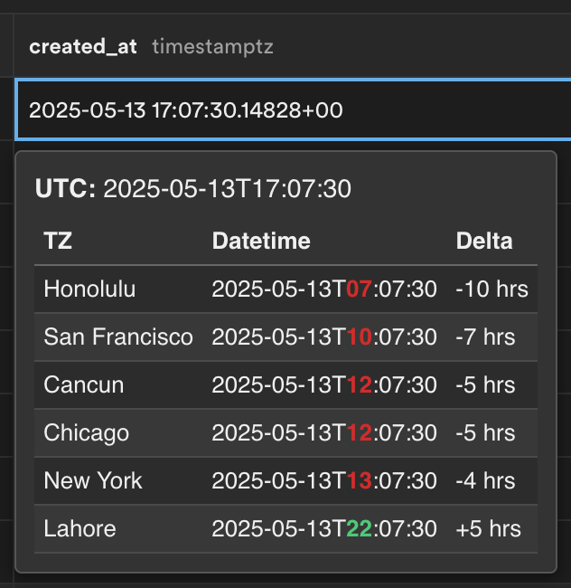

# Supasync - Supabase Timezone Converter

Quickly convert UTC datetimes in your Supabase tables to multiple timezones, with visual highlighting of differences.

## How to Use

1.  Install the extension.
2.  Navigate to your Supabase project and open a table in the editor view.
3.  Single-click on any cell containing a datetime string (e.g., `2023-10-26T14:30:00Z` or `2023-10-26 14:30:00+00`).
4.  A small panel will appear below the selected cell showing the UTC time and its conversions to the configured timezones, along with the delta and highlighted differences.
5.  Click anywhere outside the panel to dismiss it.

## Installation

### From Chrome Web Store (Recommended)

_Once published, you will be able to install Supasync directly from the Chrome Web Store._ (Link will be added here)

### Manual Installation (for development or testing)

1.  Download the extension files (or clone the repository).
2.  Open Chrome and navigate to `chrome://extensions`.
3.  Enable "Developer mode" using the toggle in the top right corner.
4.  Click the "Load unpacked" button.
5.  Select the directory where you downloaded/cloned the extension files (the directory containing `manifest.json`).
